# Pokédex (Angular v20)

A Pokédex built with Angular 20 and loaded with references 
to the Pokémon universe!\
This project was created to demonstrate knowledge of Angular standalone, 
reactive components, integration with external APIs, and good architectural 
and UI/UX practices.

------------------------------------------------------------------------


## 🔰 Badges


------------------------------------------------------------------------

## 🚀 Tecnologies

  | Tecnology     | Version     |
  | ------------- | ----------- |
  | **Angular**   |   20.3.15   |
  | **Typescript**|   5.9.3     |
  | **RxJS**      |   7.8.0     |
  | **PokéAPI**   |   v2        |
  | **SCSS**      |   custom    |

------------------------------------------------------------------------

## 📦 How to run this project?

### 1️⃣ Install the dependences

``` bash
ng install
```

------------------------------------------------------------------------

### 2️⃣ Run the development server

``` bash
ng serve
```

After, open the browser:

    http://localhost:4200/

------------------------------------------------------------------------

## 3️⃣ Generate production build

``` bash
ng build
```

The build will be located in:

    dist/angular-pokedex/

------------------------------------------------------------------------

 ## 4️⃣ Run the tests

 ```bash
 ng test --watch=false --browsers=ChromeHeadless
 ```

Final Test Suite Status:

Total Tests: 430 ✅ \
All Passing: 430 SUCCESS

------------------------------------------------------------------------

## 🎨 Why did I make certain choices?

### 🔹 **Use of standalone components**

Angular 19 encourages the use of standalone components, 
eliminating the need for modules.\
This makes the project simpler and faster to navigate.

I chose Signals because:
	•	They eliminate the need for Subjects and BehaviorSubjects
	•	They are more performant
	•	They integrate better with the new template syntax (@for, @if)
	•	hey facilitate automatic dependency tracking

### 🔹 **Layout inspired by the Pokémon anime**

-   Header with classic font and colors from the series.\
-   Animated Poké Ball as loading screen..\
-   Light and fun aesthetic, yet still responsive.

### 🔹 Evolution of Pokémon with a dynamic grid.

The PokéAPI has non-linear evolutions (Eevee, Slowpoke, etc.).
So I implemented:
	•	Automatic detection of parallel evolutions
	•	Grid with 2 or 3 columns depending on the number of offspring
	•	Recursive rendering with ngTemplateOutlet

### 🔹 **Customized toasts**

Created without external libraries, to maintain the project's lightness and 
independence from third parties.\

Built in CSS + Angular Signals because:
	•	Angular Material would be unnecessary for this project
	•	Allows for custom animations and layout
	•	Allows for a queue of simultaneous toasts

### 🔹 **Loading fullscreen**

Built with pure SCSS, inspired by Bootstrap's loading screen, but 
styled with a Poké Ball.

### 🔹 **Use of Angular Signals**

The project uses signals in the `PokemonStore` for simple state management: 

- loading\
- error\
- pokemon\
- type data

This reduces the need for complex services or NgRx for something small.

### 🔹 Pure SCSS instead of Tailwind or Bootstrap

Reasons:
	•	Personal project for practicing modern CSS
	•	Greater visual control
	•	Fewer external dependencies
	•	Lighter build
------------------------------------------------------------------------

## 📁 General project structure

    src/
     ├── app/
     │    ├── shared/
     │    │     ├── store/pokemon-store.service.ts
     │    │     └── models/
     │    ├── components/
     │    │     ├── pokemon-card/
     │    │     ├── pokemon-header/
     │    │     ├── pokemon-types-analysis/
     │    │     └── toast/
     │    └── app.component.ts
     ├── assets/
     └── public/ (Pokémon font)

------------------------------------------------------------------------

## 🧩 Features

- ✔ Search by Pokémon name  
- ✔ Full data display (types, abilities, stats, games, etc.) 
- ✔ Interactive and responsive evolution chain 
- ✔ Analysis of weaknesses, resistances, and immunities 
- ✔ Custom error toasts 
- ✔ Loading full-screen with animated Poké Ball  
- ✔ Layout inspired by the classic Pokédex design  
- ✔ Mobile and desktop support

------------------------------------------------------------------------

## 📸 Preview

Main page (search bar):


Main page (pokémon infos):
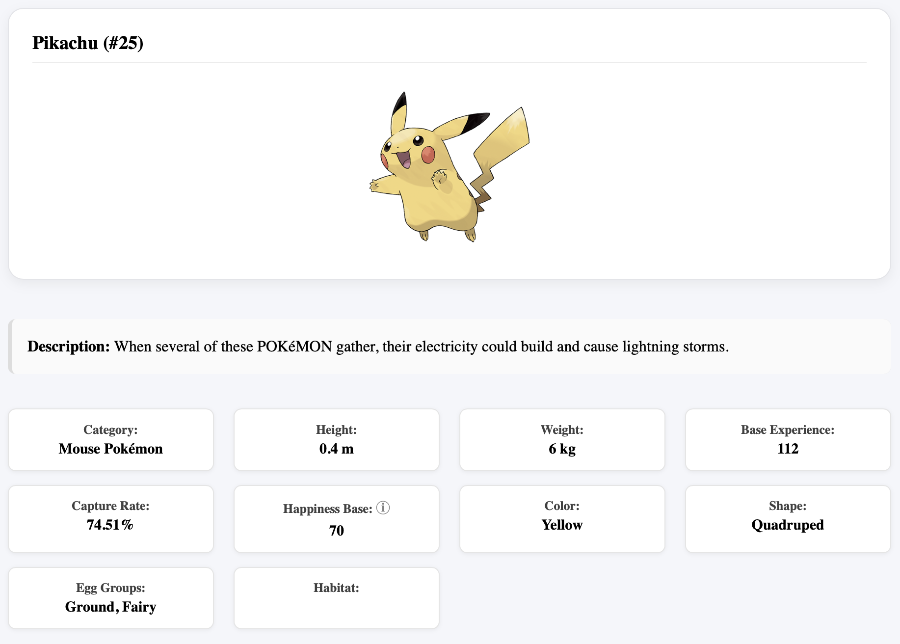

Main page (Evolution chain 1):
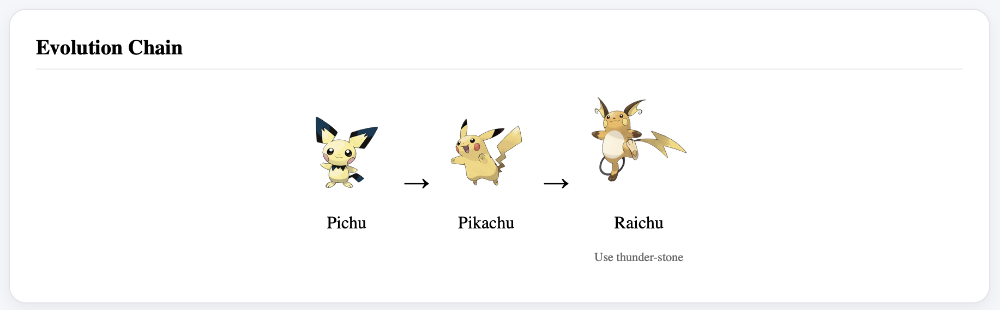

Main page (Evolution chain 2):
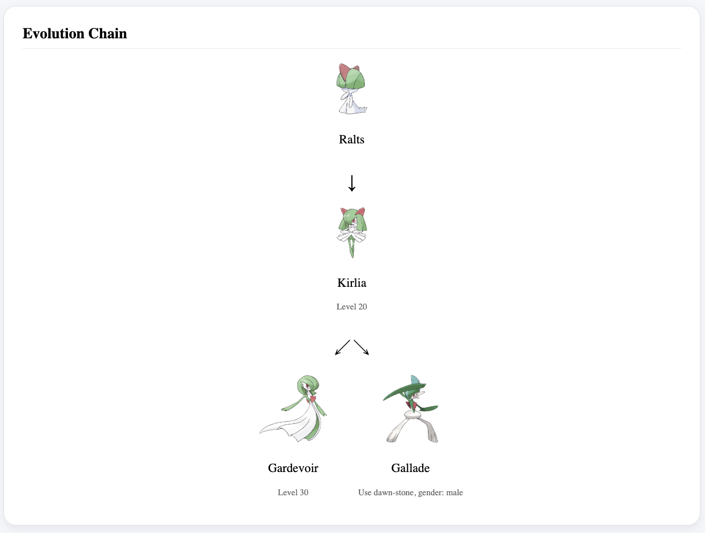

Main page (Evolution chain 3):
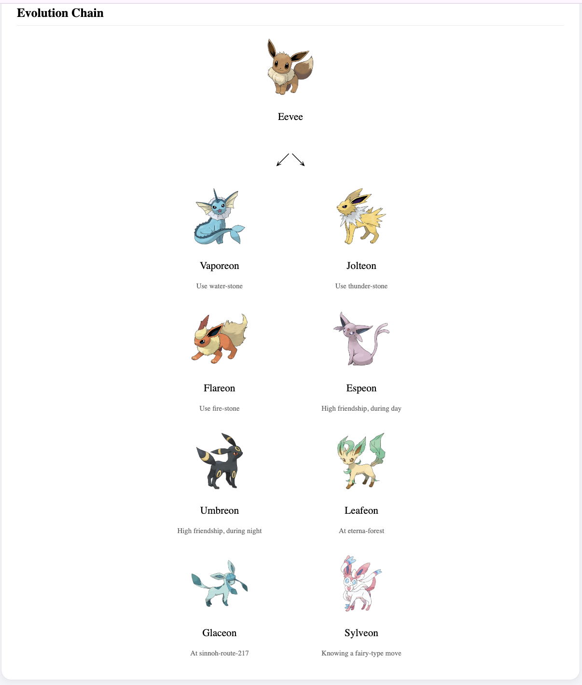

Main page (Evolution chain 4):
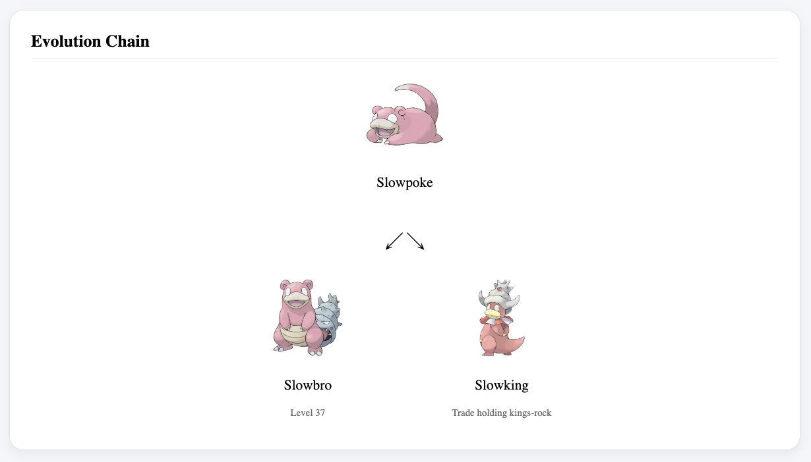

Main page (Evolution chain 5):
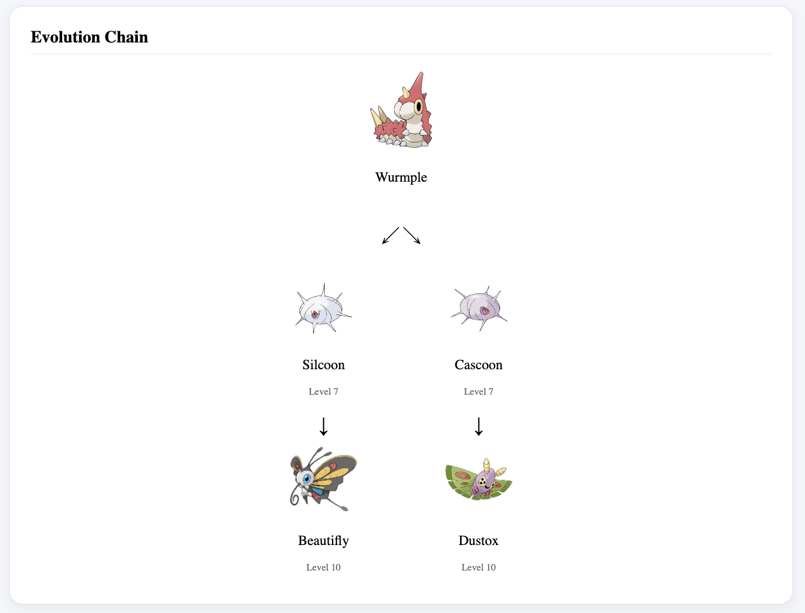

Main page (Evolution chain 6):
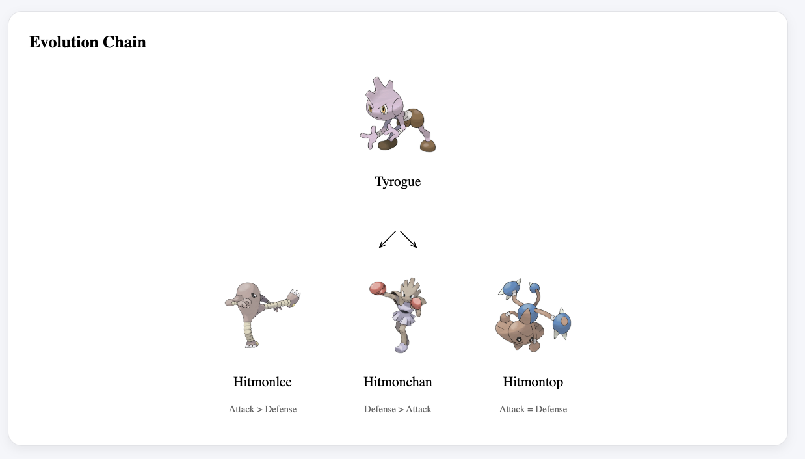

Main page (Pokemon Status):
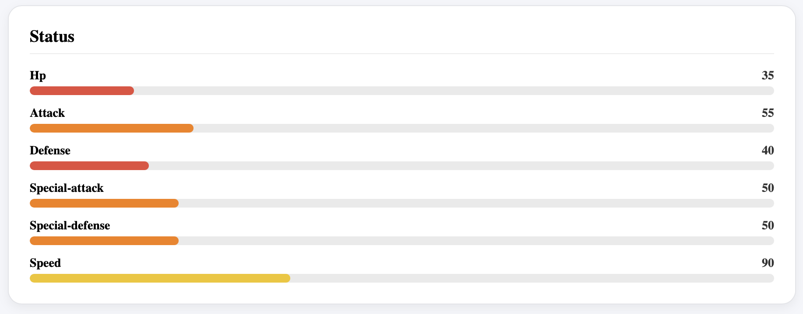

Main page (Pokemon Type):
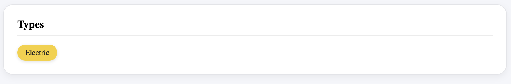

Main page (Pokemon Weakness and Resistance):
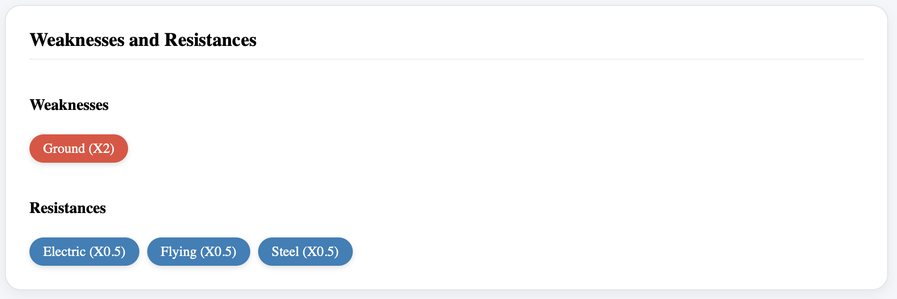

Main page (Pokemon Abilities):
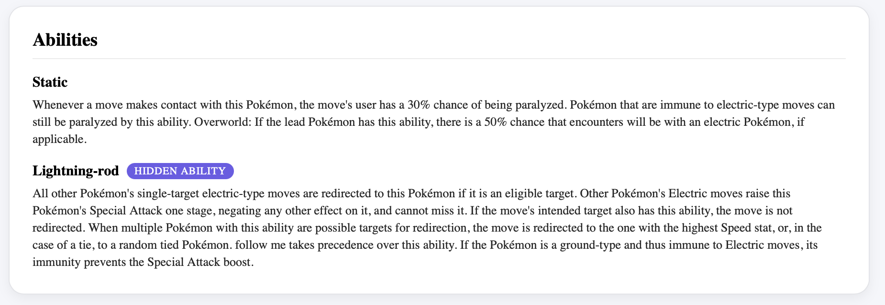

Main page (Pokemon Moves):
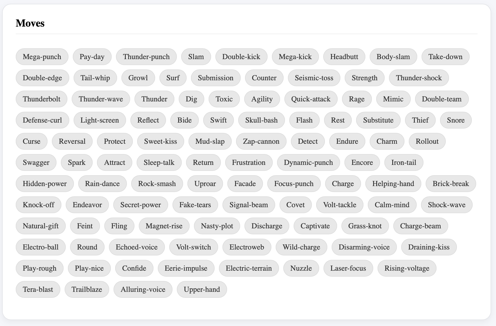

Main page (Pokemon Move Details):
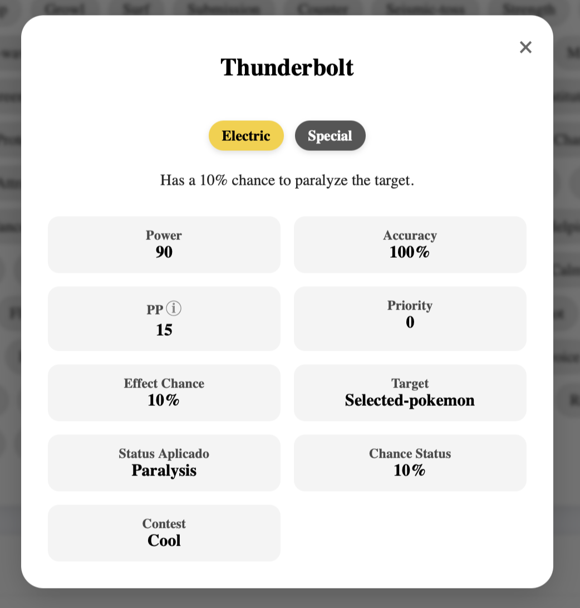

Main page (Pokemon Games):
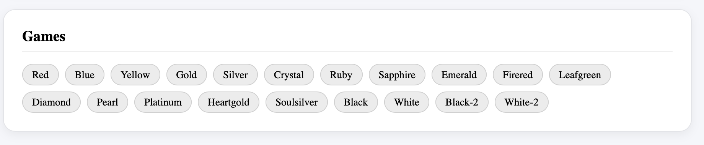

------------------------------------------------------------------------

## 🧪 Next steps (possible developments)

-   Autocomplete list in searchbar ✅
-   Create a complete details page ✅
-   Compare Pokémon side-by-side.
-   Login page to create your Pokémon team.
-   Unit tests (karma) ✅

------------------------------------------------------------------------

## 🤝 Contribution

-   Fork the projetc.\
-   Create your branch: git checkout -b feature/minha-feature \
-   Commit: git commit -m 'Adiciona minha feature' \
-   Push: git push origin feature/minha-feature \
-   Open a Pull Request

------------------------------------------------------------------------

## ⚡ Author

Projetc created by **Edward Ramos** as a demonstration of proficiency in 
Angular 19, UI/UX, and API integration.

------------------------------------------------------------------------

## 📄 Licence

This project is licensed under the following license: **MIT**.

------------------------------------------------------------------------

Gotta catch 'em all! 🔥🐉
